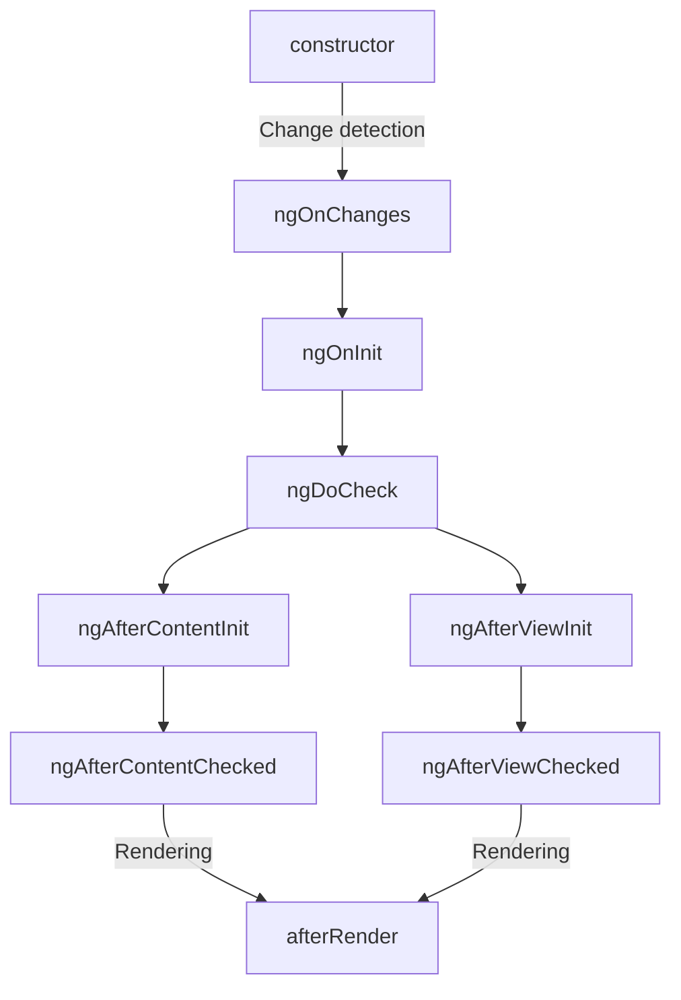
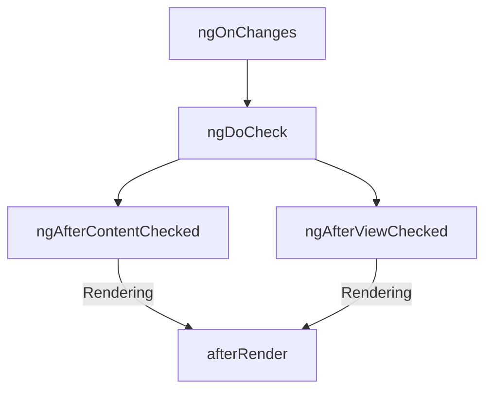

## Component Lifecycle

### During initialization

```mermaid
flowchart TB

A[constructor] --> |Change detection| B[ngOnChanges]
B --> C[ngOnInit]
C --> D[ngDoCheck]
D --> E[ngAfterContentInit]
E --> G[ngAfterContentChecked]
D --> F[ngAfterViewInit]
F --> H[ngAfterViewChecked]
G --> |Rendering| I[afterRender]
H --> |Rendering| I[afterRender]
```

### Subsequent updates

```mermaid
flowchart TB

B[ngOnChanges] --> D[ngDoCheck]
D --> G[ngAfterContentChecked]
D --> H[ngAfterViewChecked]
G --> |Rendering| I[afterRender]
H --> |Rendering| I[afterRender]
```
